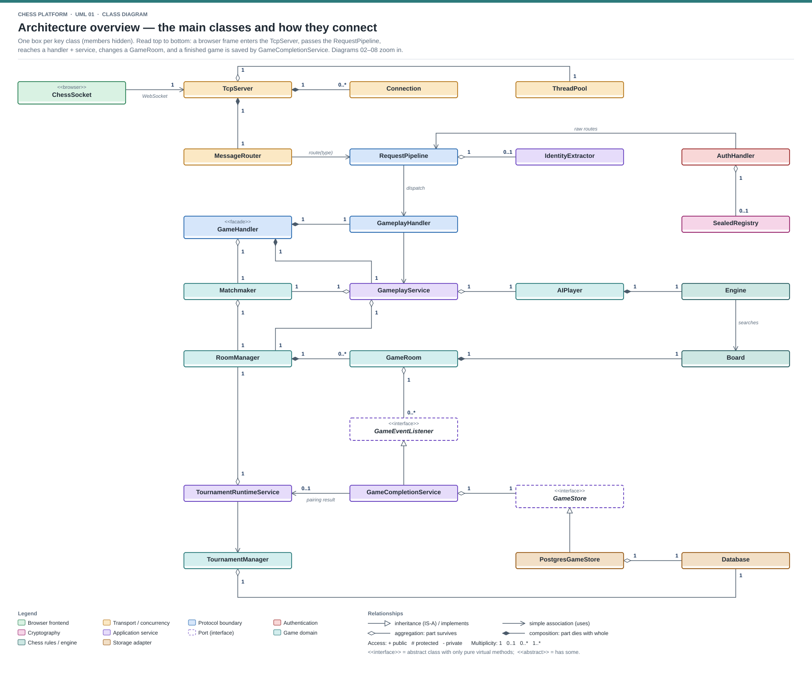

# Multiplayer Chess Platform

A C++17 multiplayer chess platform with server-authoritative rules and clocks, a static browser client, Supabase PostgreSQL persistence and password/Google authentication.

Built as an educational systems project: networking, concurrency, chess rules, search and selected cryptographic primitives are implemented in the repository. OpenSSL supplies sensitive primitives such as password hashing, randomness and lattice cryptography; libpq, libcurl and nlohmann/json provide database, HTTPS and JSON support.

**Release candidate:** locally tested; not yet deployed. Production OAuth, session recovery and capacity still require validation on the hosted environment.

## Features

- Online rooms, rating-band matchmaking and bounded-difficulty AI play.
- Shared Canvas board with SVG pieces, drag/tap input and responsive layouts.
- Resignation, draw offers and ordinary-game rematches.
- Authenticated read-only spectating and saved-game replays.
- Profile, rating, leaderboard and game-history queries.
- Scheduled **Swiss** and **Winners Advance** tournaments: registration locks, check-in, start gates, byes, no-shows and automatic results.
- Advancement-based Winners Advance placement, reversed-color draw replay and a two-draw same-pair cap.
- Password accounts and Google sign-in through Supabase identity verification.
- Unique username/email registration, password setup after email verification and automatic sign-in after activation/reset. New passwords require at least 8 characters, an uppercase letter, a number and a special character. Single-use password recovery and verified Google/password account reuse; Gmail SMTP configuration required for new password registrations.
- Single-use post-quantum hybrid sealed authentication alongside production TLS.
- Engine analysis and statistical anti-cheat reports for review, not automatic bans.
- Invite/result sharing, daily bundled puzzles, local streaks and named bot choices.

### Tournament formats

| Format | Progression | Placement |
| --- | --- | --- |
| Swiss | Creator selects a fixed round count; odd fields receive a bye, never a bot | Score and Buchholz |
| Winners Advance | Winners and bye recipients advance through automatic stages; a first draw replays with reversed colors, and two draws prohibit another game between that pair | Advancement/elimination stage first; wins break ties among final survivors |

Both formats reuse ordinary gameplay, names, clocks, Resign and Offer draw. Check-in never bypasses the scheduled start. Equal final-survivor wins can produce joint champions; a bye does not count as a played win.

## Documentation

| Document | Purpose |
| --- | --- |
| [Implementation plan](implementation_plan.md) | Completed phases, release gates and major additions |
| [Frontend implementation plan](frontend_implementation_plan.md) | Consolidated browser roadmap and remaining UX work |
| [Architecture](docs/ARCHITECTURE.md) | Services, ownership, concurrency and deployment limits |
| [Protocol](docs/PROTOCOL.md) | Messages, authorization and lifecycle invariants |
| [Security](docs/SECURITY.md) | Identity, sealing, database isolation and secret handling |
| [Sequences](docs/SEQUENCES.md) | Request order, locks, commit points and recovery |
| [Benchmarks](docs/BENCHMARKS.md) | Measured results and reproduction boundaries |
| [UML diagrams](UML/README.md) | Server and browser class/lifecycle views |

## Architecture at a glance

The backend is a modular monolith: transport and a structural JSON request pipeline dispatch to application services, which use domain objects and narrow persistence/delivery ports.



Room state is protected independently, notifications run after room locks are released, and bounded identity-read pooling overlaps database waits without interleaving transactions on one connection.

## Build and run

Use Linux or WSL2; the server needs POSIX sockets, epoll and pthreads. The local reference toolchain uses Ubuntu 26.04, GCC 15.2 and OpenSSL 3.5.5.

Dependencies: CMake 3.16+, C++17 compiler, OpenSSL 3.5+, PostgreSQL/libpq development headers, libcurl development headers and the vendored JSON header.

```bash
cmake -S . -B build_release -DCMAKE_BUILD_TYPE=Release
cmake --build build_release --parallel 2
./build_release/chess_server
```

The listener defaults to port 9000, overridable with PORT. Supply configuration securely through the process environment; the executable does not automatically load environment files.

Serve the static frontend separately:

```bash
python3 -m http.server 8000 --directory frontend
```

Open http://localhost:8000. Required runtime browser assets—including the vendored crypto bundle, integrity manifest and licenses—must accompany the frontend.

A bare CMake configuration has no default Release optimization. Use Release for benchmarks.

### Docker

Build the backend image from the repository root:

```bash
docker build --tag chess-engine:local .
```

The multi-stage image runs the server as a non-root user. It does not include the static frontend or deployment secrets. Supply the runtime environment and private identity file separately; expose the port selected by PORT. Without authenticated configuration, a local compatibility startup is not a full release smoke test.

Database-backed features require the matching schema migrations. Review migration prerequisites and use a disposable database for tests; do not blindly run benchmark/test provisioning against the hosted application database.

## Configuration

| Setting | Purpose |
| --- | --- |
| PORT | Listener port; injected by the cloud runtime |
| DATABASE_URL | Secret PostgreSQL connection URI; required for accounts/persistence/tournaments |
| JWT_SIGNING_KEY | Secret base64 encoding of exactly 32 random bytes |
| SERVER_IDENTITY_KEY_PATH | Mounted private ML-DSA identity file |
| AUTH_SEAL_REQUIRED | Set 1 for fail-closed production sealing |
| SUPABASE_JWT_ALGORITHM | ES256 for Google identity using P-256 public keys |
| SUPABASE_ISSUER | Public Supabase issuer ending in /auth/v1 |
| SUPABASE_AUDIENCE | authenticated |
| AUTH_READ_POOL_SIZE | Identity-read pool size 0–4; default 2 |
| SERVER_WORKER_THREADS | Worker count 1–8; default 4 |
| SMTP_USERNAME | Gmail account used to send verification/recovery emails |
| SMTP_PASSWORD | Secret Gmail App Password, supplied at runtime |
| AUTH_PUBLIC_URL | Public HTTPS frontend origin without trailing slash |

ES256 uses verified HTTPS public JWKS; no Supabase private signing key/shared JWT secret is needed. See [Security](docs/SECURITY.md) for legacy compatibility and operational details.

Without database/auth configuration the server may start with disabled/null adapters in a local compatibility profile. That is not an authenticated release configuration. Required production sealing rejects missing authentication or invalid identity configuration.

## Tests and benchmarks

CMake declares core test executables alongside the server. Keep test sources and shared fixtures available even when building only chess_server.

Representative checks:

```bash
./build_release/test_move_gen
./build_release/test_engine
./build_release/test_hash
./build_release/test_aes
./build_release/test_pqc
./build_release/test_sealed_envelope
./build_release/test_tournament
./build_release/test_tournament_runtime
node tests/test_frontend_game.mjs
node tests/test_frontend_session.mjs
node tests/test_frontend_tournament.mjs
```

Use a deliberately selected disposable local database for DB-backed suites. A skipped database suite is not a verified pass. Some developer tooling assumes a local database/user; inspect its setup before execution.

The newer warm hosted-read comparison measured four concurrent identity reads at **632 ms with one connection versus 308 ms with two**. Short local mixed move/tournament-read probes passed up to 60 active accounts; these exclude sustained production, login storms and AI load.

See [Benchmarks](docs/BENCHMARKS.md) for CPU restrictions, percentiles and caveats. No production simultaneous-player limit has been measured.

## Release status and limitations

Core release features, reported local tournament acceptance sets and constrained local container smoke checks are complete. Cloud deployment and production session/OAuth/reconnect validation remain pending.

Live rooms are process-local. Saved results persist in PostgreSQL, but an in-progress board is not transparently restored after a backend process restart or shared between instances. The intended first release uses one backend instance.

Min-zero/max-one permits cold starts; it does not guarantee zero billing. Deployment configuration and capacity need verification on the actual hosted workload.

The frontend, public identity pins and vendor licenses can be published. Database credentials, application signing keys and private identity files must remain outside source control and container layers. Reported local test success is not an independent security audit.

## Repository layout

```text
src/
  core/          types, result handling and logging
  net/           sockets, epoll, WebSocket and delivery
  concurrent/    worker pool and task queue
  protocol/      codecs, route policy and request pipeline
  application/   services and ports
  chess/         board, rules, notation, evaluation and search
  game/          rooms, handlers, matchmaking and AI integration
  auth/          passwords, tokens, sessions and Google verification
  crypto/        primitives, sealing and identity loading
  storage/       libpq adapters, repositories, pooling and migrations
  tournament/    pairing, progression, lifecycle and storage
  analysis/      statistical review tools
frontend/        static HTML/CSS/JavaScript and runtime assets
tests/           correctness, security, service and browser regressions
tools/           reusable utilities and benchmarks
docs/            architecture, protocol, security, sequences and benchmarks
UML/             published SVG diagrams
```
