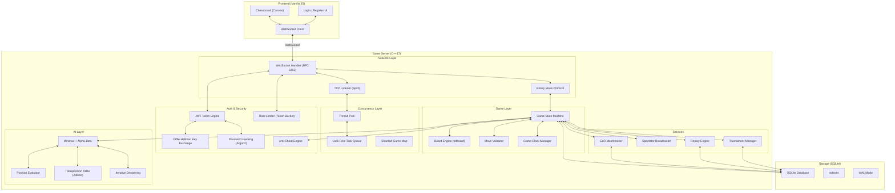

# Multiplayer Chess Platform — Implementation Plan

## Project Overview

Build a **production-grade multiplayer chess platform** from near-scratch in C++17, demonstrating deep mastery of OS, networking, databases, algorithms, cryptography, and system design — using only 3 external libraries.

**Goal**: A platform where two players can play real-time chess over the network, watch others play, replay games, and compete against an AI engine — all built on infrastructure you wrote yourself.

---

## Architecture



---

## Technology Stack

| Layer | Choice | Rationale |
|---|---|---|
| **Language (Backend)** | C++17 | Systems-level control, performance, manual memory management shows depth |
| **Language (Frontend)** | Vanilla JS + HTML5 Canvas | No framework overhead, full control |
| **Build System** | CMake 3.16+ | Industry standard for C++ |
| **Database** | SQLite 3 (embedded) | Zero-config, single file, SQL support — no separate server |
| **Crypto Primitives** | OpenSSL 3.x | Battle-tested SHA-256, AES, HMAC, DH, random bytes |
| **JSON** | nlohmann/json (header-only) | Single header, no build complexity |
| **Networking** | POSIX sockets + epoll | Raw system calls — the whole point |
| **Platform** | Linux (WSL2 on Windows) | epoll, POSIX threads, standard systems programming environment |
| **Version Control** | Git + GitHub | Clean commit history, branching |
| **Testing** | GoogleTest + custom bench harness | Unit tests + integration tests + load tests |

> [!IMPORTANT]
> **Development Environment**: Since you're on Windows, use **WSL2 (Ubuntu 22.04+)**. This gives you native Linux with epoll, POSIX sockets, and pthreads. All development and compilation happens inside WSL2. The frontend runs in your Windows browser connecting to the WSL2 server.
>
> Setup: `wsl --install -d Ubuntu-22.04`, then install `build-essential cmake libsqlite3-dev libssl-dev libgtest-dev`.

---

## Project Structure

```
chess-platform/
├── CMakeLists.txt                  # Root build configuration
├── README.md                       # Project overview + benchmarks
├── ARCHITECTURE.md                 # Design decisions document
├── .gitignore
│
├── third_party/                    # External dependencies
│   └── json.hpp                    # nlohmann/json (single header)
│
├── src/
│   ├── main.cpp                    # Entry point — starts the server
│   │
│   ├── core/                       # Foundation layer
│   │   ├── types.h                 # Common typedefs, enums, constants
│   │   ├── result.h                # Result<T, E> error handling type
│   │   └── logger.h / logger.cpp   # Structured logging (timestamp, level, thread)
│   │
│   ├── net/                        # Network layer
│   │   ├── tcp_server.h / .cpp     # epoll-based TCP listener
│   │   ├── connection.h / .cpp     # Per-connection state & buffer management
│   │   ├── websocket.h / .cpp      # WebSocket handshake + frame codec
│   │   └── protocol.h / .cpp       # Binary move protocol (encode/decode)
│   │
│   ├── concurrent/                 # Concurrency primitives
│   │   ├── thread_pool.h / .cpp    # Fixed-size thread pool + task queue
│   │   ├── task_queue.h            # Thread-safe MPMC queue
│   │   └── sharded_map.h           # Sharded concurrent hashmap
│   │
│   ├── chess/                      # Chess game logic
│   │   ├── board.h / .cpp          # Board representation (bitboard or array)
│   │   ├── move.h                  # Move struct (from, to, piece, flags)
│   │   ├── move_gen.h / .cpp       # Legal move generation
│   │   ├── validator.h / .cpp      # Move validation + special rules
│   │   └── notation.h / .cpp       # PGN / algebraic notation parser
│   │
│   ├── engine/                     # Chess AI
│   │   ├── search.h / .cpp         # Minimax + alpha-beta + iterative deepening
│   │   ├── eval.h / .cpp           # Position evaluation function
│   │   ├── transposition.h / .cpp  # Zobrist hashing + transposition table
│   │   └── opening_book.h / .cpp   # Pre-computed opening moves
│   │
│   ├── auth/                       # Authentication & security
│   │   ├── jwt.h / .cpp            # JWT token creation / verification
│   │   ├── password.h / .cpp       # Argon2/bcrypt password hashing
│   │   ├── dh_exchange.h / .cpp    # Diffie-Hellman key exchange
│   │   ├── rate_limiter.h / .cpp   # Token bucket rate limiter
│   │   └── session.h / .cpp        # Session management & expiry
│   │
│   ├── game/                       # Game server logic
│   │   ├── game_room.h / .cpp      # Single game instance (2 players + state)
│   │   ├── room_manager.h / .cpp   # Create/find/destroy game rooms
│   │   ├── matchmaker.h / .cpp     # ELO-based matchmaking queue
│   │   ├── spectator.h / .cpp      # Spectator fan-out broadcaster
│   │   ├── clock.h / .cpp          # Chess clock (Fischer increment)
│   │   └── anti_cheat.h / .cpp     # Statistical move-time analysis
│   │
│   ├── storage/                    # Database layer
│   │   ├── database.h / .cpp       # SQLite connection + query wrapper
│   │   ├── schema.sql              # DDL for all tables
│   │   ├── migrations/             # Schema migration files
│   │   ├── player_repo.h / .cpp    # Player CRUD + ELO updates
│   │   ├── game_repo.h / .cpp      # Game storage + history queries
│   │   └── tournament_repo.h / .cpp# Tournament data
│   │
│   ├── tournament/                 # Tournament system
│   │   ├── tournament.h / .cpp     # Tournament lifecycle management
│   │   └── swiss.h / .cpp          # Swiss-system pairing algorithm
│   │
│   └── replay/                     # Game replay & analysis
│       ├── replay_engine.h / .cpp  # Reconstruct game state from move list
│       └── analyzer.h / .cpp       # Engine evaluation at each position
│
├── frontend/                       # Web client
│   ├── index.html                  # Main page
│   ├── css/
│   │   └── style.css               # All styles (dark theme, responsive)
│   ├── js/
│   │   ├── app.js                  # Entry point, routing
│   │   ├── board.js                # Canvas chessboard renderer
│   │   ├── pieces.js               # Piece sprites + drag-drop
│   │   ├── websocket.js            # WebSocket client + reconnection
│   │   ├── auth.js                 # Login/register UI logic
│   │   ├── game.js                 # Game state, move submission, clock
│   │   ├── spectator.js            # Spectator view
│   │   ├── replay.js               # Replay viewer
│   │   └── tournament.js           # Tournament bracket UI
│   └── assets/
│       └── pieces/                 # Chess piece SVGs (standard set)
│
├── tests/                          # All tests
│   ├── unit/
│   │   ├── test_board.cpp          # Chess logic tests
│   │   ├── test_move_gen.cpp       # Move generation correctness
│   │   ├── test_engine.cpp         # Engine search tests
│   │   ├── test_websocket.cpp      # Frame parsing tests
│   │   ├── test_jwt.cpp            # Token creation/validation
│   │   ├── test_protocol.cpp       # Binary protocol encode/decode
│   │   ├── test_rate_limiter.cpp   # Token bucket behavior
│   │   └── test_matchmaker.cpp     # ELO calculation tests
│   ├── integration/
│   │   ├── test_game_flow.cpp      # Full game lifecycle test
│   │   └── test_auth_flow.cpp      # Register → login → play flow
│   └── bench/
│       ├── bench_server.cpp        # Concurrent connection load test
│       ├── bench_engine.cpp        # Engine nodes/sec measurement
│       └── bench_throughput.cpp    # Moves/sec under load
│
├── tools/                          # Utility scripts
│   ├── load_test.py                # Python script to simulate N clients
│   ├── generate_opening_book.py    # Parse PGN database into opening book
│   └── benchmark_report.py         # Collect and format benchmark results
│
└── docs/
    ├── PROTOCOL.md                 # Binary protocol specification
    ├── API.md                      # WebSocket message API reference
    ├── SECURITY.md                 # Auth flow, threat model
    └── BENCHMARKS.md               # Performance results with graphs
```

---

## Professional Engineering Standards

### Code Standards

| Standard | Rule |
|---|---|
| **Naming** | `snake_case` for files/variables/functions, `PascalCase` for classes/structs, `UPPER_SNAKE` for constants |
| **Headers** | Use `#pragma once`. Forward-declare where possible. |
| **Error Handling** | No exceptions for control flow. Use `Result<T, Error>` pattern. Log all errors with context. |
| **Memory** | RAII everywhere. `std::unique_ptr` for ownership, raw pointers only for non-owning references. Zero `new`/`delete`. |
| **Concurrency** | Always lock in consistent order. Document lock hierarchies. Use `std::lock_guard` / `std::unique_lock`, never raw `.lock()/.unlock()`. |
| **Comments** | Every file gets a top-of-file doc comment explaining purpose. Every public method gets a doc comment. No obvious comments ("increment i"). |
| **Logging** | Structured logs: `[2026-07-03 14:22:01] [INFO] [thread-3] [game-room-42] Player connected: user_id=157` |

### Git Workflow

| Rule | Details |
|---|---|
| **Branching** | `main` (stable) ← `dev` (integration) ← `feature/*` (individual features) |
| **Commits** | Conventional commits: `feat:`, `fix:`, `refactor:`, `test:`, `docs:`, `perf:` |
| **Commit size** | Each commit compiles and passes tests. No "WIP" commits on main. |
| **PR discipline** | Even solo — write a brief description for each merge. Builds the habit. |

**Example commit history** (what interviewers see on GitHub):
```
feat: implement Zobrist hashing for transposition table
perf: switch from std::map to sharded concurrent hashmap — 3.2x throughput
fix: WebSocket frame masking was applied in wrong byte order
test: add perft tests for move generation (depth 5, all positions)
feat: add spectator fan-out with non-blocking broadcast
docs: add protocol specification for binary move encoding
perf: reduce per-game memory from 48KB to 11KB via bitboard
```

### Testing Strategy

| Level | What | Tool | When |
|---|---|---|---|
| **Unit tests** | Board logic, move gen, protocol codec, JWT, rate limiter | GoogleTest | Every commit |
| **Perft tests** | Move generation correctness (count legal moves at depth N, compare to known values) | Custom | After any chess logic change |
| **Integration tests** | Full game flow: connect → auth → matchmake → play → game over → save | Custom client script | Each phase completion |
| **Load tests** | Simulate 100–500 concurrent games, measure latency percentiles | Python script (`load_test.py`) | Phase 10 |
| **Engine tests** | Known tactical positions → verify engine finds the right move | Custom | After engine changes |

---

## Database Schema

```sql
-- Players
CREATE TABLE players (
    id          INTEGER PRIMARY KEY AUTOINCREMENT,
    username    TEXT UNIQUE NOT NULL,
    password_hash TEXT NOT NULL,        -- Argon2 hash
    salt        TEXT NOT NULL,
    elo_rating  INTEGER DEFAULT 1200,
    games_played INTEGER DEFAULT 0,
    wins        INTEGER DEFAULT 0,
    losses      INTEGER DEFAULT 0,
    draws       INTEGER DEFAULT 0,
    created_at  DATETIME DEFAULT CURRENT_TIMESTAMP,
    last_login  DATETIME
);
CREATE INDEX idx_players_elo ON players(elo_rating);
CREATE INDEX idx_players_username ON players(username);

-- Games
CREATE TABLE games (
    id          INTEGER PRIMARY KEY AUTOINCREMENT,
    white_id    INTEGER NOT NULL REFERENCES players(id),
    black_id    INTEGER NOT NULL REFERENCES players(id),
    moves       TEXT NOT NULL,          -- Compact move encoding (e.g., "e2e4 e7e5 g1f3...")
    result      TEXT CHECK(result IN ('1-0', '0-1', '1/2-1/2', '*')),
    termination TEXT CHECK(termination IN ('checkmate', 'resignation', 'timeout', 'stalemate', 'draw_agreement', 'insufficient', 'repetition', 'fifty_move')),
    opening_eco TEXT,                   -- ECO code for opening classification
    white_elo   INTEGER,               -- ELO at time of game
    black_elo   INTEGER,
    time_control TEXT,                  -- e.g., "600+5" (10min + 5sec increment)
    started_at  DATETIME NOT NULL,
    ended_at    DATETIME,
    move_count  INTEGER
);
CREATE INDEX idx_games_white ON games(white_id, started_at DESC);
CREATE INDEX idx_games_black ON games(black_id, started_at DESC);
CREATE INDEX idx_games_opening ON games(opening_eco);

-- Game move timestamps (for anti-cheat analysis)
CREATE TABLE move_times (
    game_id     INTEGER NOT NULL REFERENCES games(id),
    move_number INTEGER NOT NULL,
    player_id   INTEGER NOT NULL REFERENCES players(id),
    think_time_ms INTEGER NOT NULL,     -- Milliseconds spent on this move
    PRIMARY KEY (game_id, move_number)
);

-- Sessions
CREATE TABLE sessions (
    token       TEXT PRIMARY KEY,       -- JWT token hash
    player_id   INTEGER NOT NULL REFERENCES players(id),
    created_at  DATETIME DEFAULT CURRENT_TIMESTAMP,
    expires_at  DATETIME NOT NULL
);
CREATE INDEX idx_sessions_player ON sessions(player_id);

-- Tournaments
CREATE TABLE tournaments (
    id          INTEGER PRIMARY KEY AUTOINCREMENT,
    name        TEXT NOT NULL,
    format      TEXT CHECK(format IN ('swiss', 'round_robin')),
    rounds      INTEGER NOT NULL,
    current_round INTEGER DEFAULT 0,
    status      TEXT CHECK(status IN ('registration', 'in_progress', 'completed')),
    created_at  DATETIME DEFAULT CURRENT_TIMESTAMP
);

CREATE TABLE tournament_players (
    tournament_id INTEGER REFERENCES tournaments(id),
    player_id   INTEGER REFERENCES players(id),
    score       REAL DEFAULT 0,         -- Swiss scoring (1 win, 0.5 draw, 0 loss)
    PRIMARY KEY (tournament_id, player_id)
);
```

---

## Binary Move Protocol

```
CLIENT → SERVER (Move Submission):  8 bytes
┌──────────┬──────────┬──────────┬──────────┬──────────┬──────────┬──────────┬──────────┐
│  MSG_TYPE │  FROM_SQ │  TO_SQ   │  FLAGS   │  GAME_ID (4 bytes, big-endian)            │
│  0x01     │  0-63    │  0-63    │  bitmask │                                           │
└──────────┴──────────┴──────────┴──────────┴──────────┴──────────┴──────────┴──────────┘

FLAGS byte:
  bit 0: promotion      bit 1-2: promo piece (00=Q, 01=R, 10=B, 11=N)
  bit 3: en passant     bit 4: kingside castle    bit 5: queenside castle

SERVER → CLIENT (Move Broadcast):  12 bytes
┌──────────┬──────────┬──────────┬──────────┬──────────┬──────────┬──────────┬──────────┐
│  MSG_TYPE │  FROM_SQ │  TO_SQ   │  FLAGS   │  GAME_ID (4 bytes)                        │
│  0x02     │          │          │          │                                           │
├──────────┼──────────┼──────────┼──────────┤
│  TIME_W (2 bytes, seconds left) │  TIME_B (2 bytes, seconds left)                     │
└──────────┴──────────┴──────────┴──────────┘

vs JSON equivalent: ~200 bytes. Binary = 94% bandwidth reduction.
```

---

## Phased Implementation Plan

---

### Phase 1 — Core Server Infrastructure *(Days 1–7)*

> **Goal**: A TCP server that accepts multiple concurrent connections via epoll, with a thread pool processing requests.

#### 1.1 Project Setup *(Day 1)*
- [ ] Initialize Git repo with `.gitignore` (build/, *.o, *.db)
- [ ] Set up CMake build system with debug/release configs
- [ ] Create directory structure (src/, tests/, frontend/, docs/)
- [ ] Install dependencies in WSL2: `build-essential cmake libsqlite3-dev libssl-dev`
- [ ] Create `src/core/types.h` with common typedefs and constants
- [ ] Create `src/core/logger.h/.cpp` with structured logging
- [ ] Verify: `cmake .. && make` produces a binary that prints "Server starting..."

#### 1.2 TCP Server with epoll *(Days 2–4)*
- [ ] Implement `TcpServer` class: `bind()`, `listen()`, `accept()`
- [ ] Set up epoll event loop in main thread (edge-triggered)
- [ ] Handle `EPOLLIN` for new connections and incoming data
- [ ] Implement non-blocking I/O with `fcntl(O_NONBLOCK)`
- [ ] Per-connection read/write buffers (`Connection` class)
- [ ] Handle partial reads and writes (TCP is a byte stream, not message stream)
- [ ] Graceful connection cleanup on disconnect / error
- [ ] Signal handling (SIGINT → graceful shutdown)
- [ ] **Test**: `telnet localhost 9000` → server echoes back input

#### 1.3 Thread Pool *(Days 5–6)*
- [ ] Implement `ThreadPool` with configurable worker count
- [ ] Thread-safe `TaskQueue` using `std::mutex` + `std::condition_variable`
- [ ] `submit(std::function<void()>)` → enqueue task
- [ ] Worker threads wait on condition variable, wake on new task
- [ ] Graceful shutdown: signal workers to stop, join all threads
- [ ] **Test**: Submit 1000 tasks, verify all complete, no races (use thread sanitizer: `-fsanitize=thread`)

#### 1.4 Integration *(Day 7)*
- [ ] epoll main loop reads data → submits processing to thread pool
- [ ] Thread pool workers process the data → write response back
- [ ] Handle thread-safe access to connection objects (per-connection mutex or connection-per-thread model)
- [ ] **Test**: 50 simultaneous telnet connections, all echoing correctly
- [ ] **Commit**: `feat: epoll TCP server with thread pool — handles 50+ concurrent connections`

**Deliverable**: A TCP echo server that handles 50+ concurrent connections with an epoll event loop and thread pool.

---

### Phase 2 — WebSocket Layer *(Days 8–12)*

> **Goal**: Browser can connect via WebSocket, send/receive messages in real-time.

#### 2.1 HTTP Upgrade Handshake *(Days 8–9)*
- [ ] Detect HTTP request in incoming data (starts with "GET / HTTP/1.1")
- [ ] Parse `Upgrade: websocket` and `Sec-WebSocket-Key` headers
- [ ] Compute `Sec-WebSocket-Accept` = Base64(SHA1(key + magic GUID))
- [ ] Send back HTTP 101 Switching Protocols response
- [ ] Mark connection as "upgraded" — future data is WebSocket frames
- [ ] **Test**: Open browser console → `new WebSocket("ws://localhost:9000")` → `onopen` fires

#### 2.2 WebSocket Frame Parser *(Days 10–11)*
- [ ] Implement frame reading per RFC 6455:
  - FIN bit, opcode (text=0x1, binary=0x2, close=0x8, ping=0x9, pong=0xA)
  - Payload length (7-bit, 16-bit, 64-bit variants)
  - Masking (client→server frames are masked, server→client are not)
  - Handle fragmented messages (FIN=0 continuation frames)
- [ ] Implement frame writing (server → client, unmasked)
- [ ] Handle ping/pong for keepalive
- [ ] Handle close frame (clean disconnect)
- [ ] **Test**: Browser sends "hello", server echoes "hello" back via WebSocket

#### 2.3 Message Routing *(Day 12)*
- [ ] Define message types as JSON: `{ "type": "login", "data": {...} }`
- [ ] Create `MessageRouter` — dispatches messages by type to handler functions
- [ ] Handle malformed messages gracefully (log + ignore, don't crash)
- [ ] **Test**: Send different message types from browser, see correct handlers fire
- [ ] **Commit**: `feat: WebSocket layer with RFC 6455 frame parsing — browser connects and chats`

**Deliverable**: A WebSocket server that a browser can connect to and exchange JSON messages with.

---

### Phase 3 — Chess Logic Engine *(Days 13–19)*

> **Goal**: Complete chess rules engine — all legal moves, all special rules, fully tested.

#### 3.1 Board Representation *(Days 13–14)*
- [ ] Design choice: **8x8 array** (simpler, start here) or **bitboard** (optimize later)
- [ ] Piece representation: enum `{ PAWN, KNIGHT, BISHOP, ROOK, QUEEN, KING }` × `{ WHITE, BLACK }`
- [ ] Board state: piece positions, side to move, castling rights (4 bools), en passant square, halfmove clock, fullmove counter
- [ ] FEN string import/export (for testing and saving positions)
- [ ] Board display (ASCII art for debugging)
- [ ] **Test**: Load starting position FEN, verify all 32 pieces in correct squares

#### 3.2 Move Generation *(Days 15–17)*
- [ ] Generate pseudo-legal moves for each piece type:
  - Pawns: single push, double push, capture, en passant, promotion (4 choices)
  - Knights: 8 L-shaped moves
  - Bishops: diagonal rays (stop at piece or board edge)
  - Rooks: horizontal/vertical rays
  - Queen: bishop + rook combined
  - King: 8 adjacent squares + castling (kingside, queenside)
- [ ] Filter pseudo-legal → legal: remove moves that leave own king in check
- [ ] Detect check, double check
- [ ] Detect checkmate (in check + no legal moves)
- [ ] Detect stalemate (not in check + no legal moves)
- [ ] Detect draws: insufficient material, threefold repetition, 50-move rule
- [ ] Castling validation: king/rook haven't moved, squares not attacked, no pieces between
- [ ] **Test (critical)**: Run **perft tests** — count legal moves at depth 1–5 from starting position, compare to published results:
  - Depth 1: 20 moves
  - Depth 2: 400
  - Depth 3: 8,902
  - Depth 4: 197,281
  - Depth 5: 4,865,609

#### 3.3 Notation & Move Execution *(Days 18–19)*
- [ ] Parse algebraic notation ("e4", "Nf3", "O-O", "exd5", "e8=Q")
- [ ] Execute move on board (update state, toggle side, update castling rights, update en passant)
- [ ] Undo move (for engine search — store undo info per move)
- [ ] PGN export: generate standard PGN from game move list
- [ ] **Test**: Play through 10 famous games via PGN import, verify final positions match
- [ ] **Commit**: `feat: complete chess logic with all special rules — perft-verified to depth 5`

**Deliverable**: A fully correct chess rules engine that passes all perft tests — the foundation everything else builds on.

---

### Phase 4 — Online Game Server *(Days 20–26)*

> **Goal**: Two browsers can play a complete game of chess against each other.

#### 4.1 Game Room Manager *(Days 20–22)*
- [ ] `GameRoom` class: holds two player connections, board state, game clock
- [ ] `RoomManager`: create room, join room, find room by ID, list open rooms
- [ ] Use sharded concurrent hashmap for room storage (from Phase 1)
- [ ] Game state machine: `WAITING → IN_PROGRESS → FINISHED`
- [ ] Handle player disconnection mid-game (pause clock, wait for reconnect up to 60s)
- [ ] **Test**: Two telnet/WebSocket clients create and join a room

#### 4.2 Move Protocol & Synchronization *(Days 23–24)*
- [ ] Define WebSocket message API:
  - `create_game` → server returns `game_id`
  - `join_game { game_id }` → server confirms, game starts
  - `make_move { from, to, promotion? }` → server validates, broadcasts to opponent
  - `game_over { result, reason }` → server announces result
- [ ] Server is **authoritative**: validate every move server-side, reject illegal moves
- [ ] Broadcast move to both players (and spectators, later)
- [ ] Implement game clock: Fischer increment (e.g., 10+5), server tracks time
- [ ] Handle timeout (flag fall) — server declares winner
- [ ] Handle resignation, draw offer, draw agreement
- [ ] **Test**: Two browser tabs play a full game to checkmate

#### 4.3 Quick-Play Matchmaking *(Days 25–26)*
- [ ] "Quick play" button: add player to matchmaking queue
- [ ] Match players with closest ELO (within ±200)
- [ ] If no match in 30 seconds, widen range
- [ ] Auto-create game room when matched
- [ ] **Test**: Open 6 browser tabs, all click "Quick play", 3 games start automatically
- [ ] **Commit**: `feat: multiplayer chess — two players can play a full game over WebSocket`

**Deliverable**: A working multiplayer chess game. **This alone is already a solid project.**

---

### Phase 5 — Frontend *(Days 27–33)*

> **Goal**: A polished, dark-themed chess UI in the browser — not a prototype, a product.

#### 5.1 Chessboard Renderer *(Days 27–29)*
- [ ] HTML5 Canvas-based 8×8 board with light/dark squares
- [ ] Load chess piece SVGs (use standard Cburnett set — free, widely used)
- [ ] Render pieces on correct squares from board state
- [ ] Highlight last move (colored squares)
- [ ] Highlight king in check (red glow)
- [ ] Highlight legal moves on piece selection (dots on valid squares)
- [ ] Coordinate labels (a–h, 1–8) around the board
- [ ] Board flipping (white on bottom for white player, black on bottom for black)
- [ ] Smooth piece animation on move (CSS transition or Canvas interpolation)

#### 5.2 Interaction & Game UI *(Days 30–31)*
- [ ] Click-to-select, click-to-move (primary input)
- [ ] Drag-and-drop pieces (advanced input)
- [ ] Move list panel (scrolling, with move numbers: "1. e4 e5 2. Nf3 Nc6...")
- [ ] Game clock display (countdown timer, turns red under 30 seconds)
- [ ] Game status bar: "Your turn", "Opponent's turn", "Check!", "Checkmate — White wins"
- [ ] Resign button, draw offer button
- [ ] Game over modal with result + option to rematch

#### 5.3 Styling & Polish *(Days 32–33)*
- [ ] Dark theme with modern aesthetics (dark gray background, subtle gradients)
- [ ] Responsive layout (works on 1920px and 1366px screens)
- [ ] Google Font (Inter or JetBrains Mono for the move list)
- [ ] Subtle micro-animations: piece snap, clock tick, check flash
- [ ] Lobby page: list of open games, "Quick Play" button, online player count
- [ ] **Test**: Play a full game in the browser, everything feels smooth
- [ ] **Commit**: `feat: polished dark-theme chess frontend with drag-drop and animations`

**Deliverable**: A beautiful, functional chess UI that feels like a real product.

---

### Phase 6 — Chess AI Engine *(Days 34–42)*

> **Goal**: Play against an AI that can beat casual players. Engine demonstrates real algorithmic depth.

#### 6.1 Minimax + Alpha-Beta *(Days 34–36)*
- [ ] Implement basic minimax search (recursive, depth-limited)
- [ ] Add alpha-beta pruning (should prune ~50% of nodes)
- [ ] Time management: search for N seconds, not N depth
- [ ] Move ordering for better pruning: captures first, then checks, then quiet moves (MVV-LVA)
- [ ] **Test**: Engine finds mate-in-1, mate-in-2 in test positions

#### 6.2 Evaluation Function *(Days 37–38)*
- [ ] Material count (pawn=100, knight=320, bishop=330, rook=500, queen=900)
- [ ] Piece-square tables (reward central knights, advanced pawns, etc.)
- [ ] King safety: penalize exposed king, reward castled king
- [ ] Pawn structure: penalize doubled/isolated/backward pawns
- [ ] Mobility: count legal moves as a bonus
- [ ] **Test**: Engine prefers positions that humans would consider "better"

#### 6.3 Transposition Table *(Days 39–40)*
- [ ] Implement Zobrist hashing: random 64-bit number for each (piece, square) combination
- [ ] Hash is incrementally updated on each move (XOR in/out)
- [ ] Store: hash → { depth, score, best_move, node_type (exact/alpha/beta) }
- [ ] Table size: fixed (e.g., 64MB), replace oldest entries
- [ ] **Test**: Same position reached by different move orders → same hash, table hit
- [ ] **Benchmark**: Measure nodes/second with and without TT

#### 6.4 Iterative Deepening + Integration *(Days 41–42)*
- [ ] Search depth 1, then depth 2, ..., until time runs out
- [ ] Use best move from previous depth for move ordering in next depth
- [ ] Integrate engine as a "player" in game rooms (play vs AI option)
- [ ] Configurable difficulty levels (limit search depth or time)
- [ ] **Benchmark**: Measure engine strength:
  - Nodes per second
  - Average depth reached in 2s
  - Win rate vs random mover
- [ ] **Commit**: `feat: chess engine with alpha-beta + Zobrist TT — 600K+ nodes/sec`

**Deliverable**: A chess engine that plays at ~1200-1500 ELO strength, with measured performance metrics.

---

### Phase 7 — Secure Identity & Login *(Days 43–57, ~15 days)* — **REWRITTEN (rev. 3)**

> [!IMPORTANT]
> **Full spec lives in [implementation_phase_7.md](implementation_phase_7.md).** This is a
> rev-3 summary — rev 1 specified a full per-connection post-quantum channel (~20 days,
> encrypting every WebSocket message including chess moves); rev 2 scoped the PQC down to the
> password; rev 3 generalises the sealed envelope into a reusable service, fixes the HMAC width
> at SHA-384, and delivers Google Sign-In **through Supabase Auth** rather than hand-rolling the
> OAuth and JWKS machinery. **Read the detailed document before starting any of it** — this
> summary is an index, not a spec.

> **Goal**: real authentication (there currently is none — usernames are unverified
> client-supplied strings), with the one password-bearing exchange protected against
> harvest-now-decrypt-later by a scoped, reusable post-quantum construction, plus Google Sign-In
> as a second way in that carries no password at all.

#### What this phase actually defends against

Two concrete threats were named: **"no attacker has advantage to login into fake account, make
invalid move and win."** Checking both against the current codebase:

- **"Invalid move and win" is already solved — zero new code in this phase.** Phase 4's
  server-authoritative validator (`Board::make_move`) already rejects any illegal move regardless
  of how it arrives. Confirmed, not touched.
- **"Fake account login" needs everything below**, because there is currently no authentication
  of any kind.

PQC is scoped to exactly the piece that benefits from it: **the password, in transit, at
registration/login.** Passwords are long-lived secrets — harvest-now-decrypt-later is a genuine
concern. Chess moves are not long-lived secrets, and `wss://` already protects them; encrypting
every move again at the application layer was solving a problem nobody has. That's the
single biggest change from the first draft.

#### Hand-rolled vs. library — the rule, applied

Standing instruction: minimize dependencies, hand-write anything formally studied. Applied
concretely:

| Hand-written (his coursework covers it) | Library call (not yet studied, or a known minefield) |
|---|---|
| SHA-256, HMAC, HKDF | **ML-KEM-768 / ML-DSA-65** — *not* for lack of theory (LWE and Module-LWE are both studied). Constant-time lattice implementation is a separate specialisation with a **silent** failure mode: weak sampling still round-trips perfectly while the keys are predictable, and even the reference Kyber code shipped a timing leak (KyberSlash, 2024) that reached many expert-written libraries. A study implementation is encouraged — it just never links into `chess_server` |
| AES-256 (SubBytes/ShiftRows/MixColumns/key expansion) | **X25519** — ECC theory studied, but not the specific constant-time field arithmetic |
| AES-256-**CTR** + HMAC (Encrypt-then-MAC) | **Argon2id** — built on BLAKE2b, out of syllabus |
| Token-bucket rate limiter, JWT construction | **CSPRNG** — never hand-rolled, full stop; `RAND_bytes`/`getrandom` only |

Note the mode choice: **CTR, not GCM.** GCM's GHASH multiplies in GF(2¹²⁸) with its own bit
convention and is a well-documented minefield (nonce-reuse is a recurring real-world CVE class)
even for experienced engineers. CTR is just AES + a counter + XOR — squarely in scope — and
Encrypt-then-MAC with hand-rolled HMAC-SHA-384 gives the same authenticated-encryption guarantee
without touching GHASH.

#### The sealed envelope — a reusable service, PQC scoped to the password

Not a persistent channel — a one-shot operation, and deliberately **payload-agnostic** so it can
be reused later:

```
1. Server mints a ONE-TIME ML-KEM-768 + X25519 keypair, signs it with its long-term ML-DSA-65 identity
2. Browser verifies that signature against a PINNED ARRAY of server-key hashes (never a single
   scalar — an array makes key rotation a safe rollout instead of a flag-day outage)
3. Browser encapsulates → hybrid shared secret → HKDF → AES-256-CTR encrypt, then HMAC-SHA-384
4. Server consumes the one-time key, verifies the tag BEFORE decrypting, recovers the plaintext,
   then Argon2id-hashes the password
5. The one-time keypair is destroyed on first lookup — a captured envelope can never be replayed,
   because the only key that could open it no longer exists
```

**Reusable by design.** The service seals and opens opaque bytes; it knows nothing about
passwords or chess. Message types opt in through a registry, and `MessageRouter` unwraps before
dispatch, so handlers never know an envelope was involved:

```cpp
sealed_registry.require_sealed("register");
sealed_registry.require_sealed("login");
sealed_registry.require_sealed("change_password");
// future, with zero new crypto work:
// sealed_registry.require_sealed("send_message");   // private chat
```

A type registered as sealed that arrives **unsealed is rejected**, so the envelope cannot be
stripped and the request downgraded.

`refresh`, `logout`, and `make_move` are **not** wrapped — none of them ever puts a raw password
on the wire, and TLS already covers transit.

This is end-to-end from the browser to the C++ process specifically because **Cloud Run
terminates TLS at the Google Front End** — the process never sees the TLS handshake, so this is
the only way to keep the password confidential from whoever terminates that connection, not just
from an on-path eavesdropper (which TLS alone already handles).

#### Sub-phases

| # | Days | Content |
|---|---|---|
| **7.0** | 43 | Scaffolding, `SecureBuffer`, CSPRNG wrapper — no OpenSSL prerequisite anymore (see below) |
| **7.1** | 44–46 | Hand-written SHA-256, HMAC, HKDF — validated against FIPS 180-4 / RFC 4231 / RFC 5869 vectors **plus** a differential test vs OpenSSL over 10,000 random inputs |
| **7.2** | 47–48 | Hand-written AES-256, CTR mode, Encrypt-then-MAC AEAD |
| **7.3** | 49 | RAII wrappers over OpenSSL's ML-KEM-768 / ML-DSA-65 / X25519 |
| **7.4** | 50–51 | The sealed-envelope service + opt-in registry + router hook; cross-language C++/JS vector test |
| **7.5** | 52 | Postgres via Supabase (`libpq`), minimal `players` + `sessions` schema |
| **7.6** | 53 | Argon2id, username validation, register/login handlers |
| **7.7** | 54 | JWT from scratch, rotating revocable refresh tokens, real `logout`/`logout_all` |
| **7.8** | 55 | **Google Sign-In via Supabase Auth** — verify the Supabase JWT, map `sub` → account, link/unlink, never auto-link on email |
| **7.9** | 56 | Token-bucket rate limiting (checked *before* Argon2id), CSP, message size caps, and a fix for the **live JSON-injection bug** in `main.cpp`'s `match_found` |
| **7.10** | 57 | Frontend integration (`config.js`, auth screen PREVIEW → LIVE, Google button), Cloud Run deploy, `SECURITY.md` |

#### Google Sign-In — why via Supabase, and the one real risk

Google Sign-In was dropped mid-revision and then reinstated, so the reasoning is worth keeping.
The stated reason for dropping it — *"Google uses RSA"* — **does not hold**: harvest-now-decrypt-later
threatens **confidentiality** (record ciphertext now, decrypt later), whereas an ID-token
*signature* is verified at login and discarded. Forging one needs RSA broken **today**, which
would mean every TLS connection on earth is already broken.

The legitimate objections were all about *hand-rolling* the OAuth machinery — an outbound HTTPS
client the server doesn't have, JWKS caching and rotation, and a heavier frontend dependency than
the PQC module. **Supabase Auth removes all three**: it performs the OAuth exchange server-side,
the C++ server verifies a single Supabase-issued JWT, and the browser flow is a plain
`window.location` redirect — **zero new frontend dependencies**. If the Supabase project signs
with the legacy HS256 secret, verification even reuses the hand-written HMAC from §7.1.

> [!WARNING]
> **Account linking is the one genuine risk.** If a Google login arrives with an email matching an
> existing password account, auto-merging them means anyone who can obtain a Google account at
> that address takes over the existing account. The rule adopted: **never auto-link on email** —
> a colliding email is refused with a message to sign in by password and link from Settings, and
> linking is always an authenticated action.

Scope boundary: Supabase is an **identity provider only**. It proves who someone is at sign-in;
this project still issues, rotates, and revokes its own sessions. Handing all of authentication to
Supabase would delete the Argon2id, JWT, and sealed-envelope work that is the substance of the phase.

#### Environment blocker from the first draft: resolved

The dev environment migrated to **Ubuntu 26.04 LTS** (Sept 2026), which ships **OpenSSL 3.5.5**
with ML-KEM, ML-DSA, and Argon2id in the default provider. The source-build-into-`/opt`
prerequisite and the multi-stage Dockerfile from the first draft are both gone —
`find_package(OpenSSL)` and `apt-get install libssl-dev` just work, in WSL and in the container.
Verified: clean build, 0 warnings under `-Werror` on GCC 15.2, all 171 existing tests still pass.

#### Deliberately not built, and why

| Not built | Why |
|---|---|
| Per-connection PQC channel for game moves | No long-term value in a move; TLS already covers the wire. This was rev 1's central mistake |
| Move hash chain / ML-DSA game receipts | Defended against the *operator* forging a result — nobody needs protection from the operator on a personal project |
| PSK resumption, rekeying, sequence counters | Existed only to make a *persistent* channel cheap; the sealed envelope is one-shot and doesn't need them |
| ML-DSA-signed session tokens | 3309 B vs 48 B for zero gain in a single process that both mints and verifies its own tokens. HMAC-SHA-384 is *already* post-quantum |
| Hand-rolled Google OAuth (JWKS fetch, token exchange, `gsi/client`) | The *feature* is kept (§7.8) but none of this machinery is written — Supabase Auth performs the exchange, so the server verifies one JWT and the browser does a plain redirect |
| Supabase Auth as the *session* system | Deliberately not. It proves identity once at sign-in; this project issues and revokes its own tokens. One session mechanism, one `logout_all` |
| Hand-rolled ML-KEM/ML-DSA **on the shipping path** | The theory is understood (LWE and Module-LWE both studied), so this is *not* deferred for lack of knowledge — constant-time lattice implementation is a distinct specialisation whose failure mode is silent. A study implementation in `research/kyber_reference/` is encouraged and **unblocked**, validated against NIST KAT vectors and differentially against OpenSSL; it simply never links into the server |

#### Deployment (Vercel + Cloud Run)

- `main.cpp` must read `$PORT` (Cloud Run injects it; hardcoded 9000 fails health checks)
- `--min-instances=1 --max-instances=1` — game state lives in process memory; two instances would
  silently split the lobby
- Deploy to **`asia-south1` (Mumbai)**: ~250 ms → ~30 ms RTT from IIT Patna — a bigger latency win
  than anything in this phase
- `frontend/js/config.js` — environment-aware `wss://` URL + the pinned key **array**

**Deliverable**: working registration/login with the password PQC-sealed against
harvest-now-decrypt-later, delivered as a **reusable envelope service** any future message type
can opt into; **Google Sign-In via Supabase Auth** as a second way in; revocable sessions with
real logout; rate limiting; one existing JSON-injection bug fixed; all hand-rolled crypto
validated against known-answer vectors *and* differentially against OpenSSL — live on Cloud Run.

---

### Phase 8 — Database Integration *(Days 58–62)* — **REVISED: Postgres via Supabase, not SQLite**

> [!IMPORTANT]
> **SQLite was replaced by Postgres (via Supabase) during Phase 7 planning**, not here — see
> [implementation_phase_7.md](implementation_phase_7.md) §7.4. The reason is a hard Cloud Run
> constraint, not a preference: Cloud Run's filesystem is ephemeral and RAM-backed, so a SQLite
> file would be wiped on every restart *and* would count against the memory limit. Phase 7
> already created a **minimal** `players` + `sessions` schema to support login. Phase 8 below
> **extends** that schema — `games`, `move_times`, ELO transactions — rather than inventing a
> database layer from scratch. This is a straight substitution in the dependency list (`libpq`
> in place of `sqlite3`), not an addition.
>
> A genuine upside of the substitution, worth noting rather than treating as a compromise:
> Postgres has real concurrent-writer support. The original SQLite plan's "connection pool or
> serialized access (SQLite is single-writer)" concern and the `PRAGMA journal_mode=WAL` dance
> both disappear — Postgres just handles it.

> **Goal**: Full game history, indexed queries, and transactional ELO updates, built on the
> `players`/`sessions` tables Phase 7 already created.

#### 8.1 Schema extension *(Days 58–59)*
- [x] Extend the Phase-7 schema (Postgres syntax: `BIGSERIAL`, `TIMESTAMPTZ`) with `games`,
      `move_times`, and the indexes from the original design (`idx_games_white`,
      `idx_games_black`, `idx_games_opening`)
- [x] `src/storage/database.h/.cpp` from Phase 7 (§7.4) is extended, not replaced — same `libpq`
      connection wrapper, same parameterized-queries-only rule
- [x] Migration file(s) under `src/storage/migrations/` so schema changes are tracked, not
      applied ad hoc against the live Supabase instance
- [x] **Test**: Insert 1000 players, query by ELO range, verify the index is used
      (`EXPLAIN ANALYZE`, the Postgres equivalent of SQLite's `EXPLAIN QUERY PLAN`)

#### 8.2 Repository Layer *(Days 60–61)*
- [ ] `PlayerRepository`: create, find by username, update ELO, get leaderboard — extends the
      Phase-7 `players` access rather than duplicating it
- [ ] `GameRepository`: save game (moves + metadata), load game by ID, query game history by player
- [ ] ELO update in a single transaction — both players' ratings update atomically:
  ```sql
  BEGIN;
  UPDATE players SET elo_rating = $1, wins = wins + 1 WHERE id = $2;
  UPDATE players SET elo_rating = $3, losses = losses + 1 WHERE id = $4;
  INSERT INTO games (...) VALUES (...);
  COMMIT;
  ```
- [ ] Query: "Get last 20 games for player X, sorted by date" (must use the index)
- [ ] **Test**: Simulate 500 games, verify ELO calculations are consistent, no data corruption
      under concurrent writers (a real test now that Postgres actually allows concurrent writers —
      this test would have been meaningless against SQLite's single-writer model)

#### 8.3 Game Persistence Integration *(Day 62)*
- [ ] On game over → save to database automatically (extends the `game_over` handler Phase 7's
      auth already gates)
- [ ] Player profile page: ELO, win/loss/draw, game history — the `get_profile` contract already
      specified in `docs/frontend_implementation.md`'s "Expected Backend Functions"
- [ ] **Test**: Play a game → close browser → reopen → game appears in history
- [ ] **Commit**: `feat: Postgres game persistence via Supabase — games, ELO transactions, indexed history queries`

**Deliverable**: All game data persisted in Postgres with proper schema, indexes, and
transactional ELO updates — extending, not duplicating, the identity store Phase 7 built.

---

### Phase 9 — Advanced Features *(Days 63–73)*

> **Goal**: Features that elevate this from "project" to "platform".

#### 9.1 Spectator Mode *(Days 63–65)*
- [ ] Any user can spectate a live game by game_id
- [ ] Fan-out broadcaster: on each move, push to all spectators (non-blocking)
- [ ] Spectator count displayed in game (and lobby)
- [ ] Spectators receive move stream, cannot interact
- [ ] Handle spectator join mid-game: send full current board state first, then live stream
- [ ] **Test**: 1 game + 20 spectators, all see moves in real-time

#### 9.2 Game Replay & Analysis *(Days 66–68)*
- [ ] Replay any completed game move-by-move in the browser
- [ ] Navigation: first / prev / next / last / auto-play with speed control
- [ ] At each position, optionally show engine evaluation (+2.3, -0.5, etc.)
- [ ] Opening name detection (match first N moves to ECO database)
- [ ] Search games by opening: "Show all games starting with 1. e4 e5"
- [ ] **Test**: Replay a 40-move game, verify every position matches

#### 9.3 Anti-Cheat *(Days 69–70)*
- [ ] Record think time per move (server-side, not client-reported)
- [ ] Statistical analysis: flag players whose move times don't correlate with position complexity
  - Engine users: complex position → instant move (suspicious)
  - Humans: complex position → longer think time (natural)
- [ ] Calculate move-time variance — very low variance = suspicious
- [ ] Compare player moves to engine's top choice — >90% agreement at depth 15+ = suspicious
- [ ] Flag, don't auto-ban. Store analysis results for review.
- [ ] **Test**: Simulate a game with artificial "engine-like" move times, verify system flags it

#### 9.4 Tournament System *(Days 71–73)*
- [ ] Create tournament: name, format (Swiss), number of rounds, time control
- [ ] Registration: players join before tournament starts
- [ ] Swiss pairing: match players with similar scores, avoid rematches
- [ ] Auto-create game rooms for each round's pairings
- [ ] Standings page: live scoreboard with tiebreaks
- [ ] Tournament lifecycle: registration → round 1 → ... → round N → results
- [ ] **Test**: 8-player Swiss tournament, 4 rounds, verify pairings follow Swiss rules
- [ ] **Commit**: `feat: spectator mode, game replay, anti-cheat, Swiss tournaments`

**Deliverable**: A full-featured chess platform with spectating, replays, anti-cheat, and tournaments.

---

### Phase 10 — Benchmarking, Polish & Documentation *(Days 74–80)*

> **Goal**: Measure everything, document everything, make it interview-ready.

#### 10.1 Load Testing *(Days 74–76)*
- [ ] Write `load_test.py`: spawn N WebSocket clients, each playing a random game
- [ ] Measure under load (100, 250, 500 concurrent games):
  - Move round-trip latency: p50, p95, p99
  - Server CPU and memory usage
  - Moves processed per second
  - Connection establishment time
- [ ] Profile with `perf` or `valgrind --tool=callgrind` — find bottlenecks
- [ ] Optimize top bottleneck (at least one optimization with before/after numbers)
- [ ] **Benchmark the engine separately**: nodes/sec, depth reached in 2s/5s/10s

#### 10.2 Performance Optimization *(Days 77–78)*
- [ ] Based on profiling results, optimize the top 2-3 bottlenecks
- [ ] Document each optimization with before/after metrics
- [ ] Example optimizations:
  - Switch board representation to bitboards (if not already)
  - Pre-compute attack tables for move generation
  - Optimize WebSocket frame parsing to avoid allocations
  - Tune thread pool size vs epoll batching
- [ ] Re-run benchmarks to verify improvements

#### 10.3 Documentation & README *(Days 79–80)*
- [ ] **README.md**: Project overview, architecture diagram, build instructions, benchmarks
- [ ] **ARCHITECTURE.md**: Design decisions with rationale ("Why epoll over poll? Why sharded locks? Why bitboards?")
- [ ] **PROTOCOL.md**: Full binary protocol specification
- [ ] **SECURITY.md**: Auth flow diagram, threat model, what's encrypted and why
- [ ] **BENCHMARKS.md**: All performance numbers with graphs (use Python matplotlib)
- [ ] Clean up code: remove TODOs, ensure all public APIs have doc comments
- [ ] Final Git cleanup: squash WIP commits, write meaningful merge descriptions
- [ ] **Commit**: `docs: comprehensive documentation — architecture, protocol, security, benchmarks`

**Deliverable**: A polished, documented, benchmarked project ready for your resume and GitHub.

---

## Summary Timeline

```
         July 2026
Week 1   ████████░░░░  Phase 1: TCP Server + Thread Pool
Week 2   ████████░░░░  Phase 2: WebSocket Layer
Week 3   ████████░░░░  Phase 3: Chess Logic Engine
Week 4   ████████░░░░  Phase 4: Online Game Server + Phase 5 start

         August 2026
Week 5   ████████░░░░  Phase 5: Frontend (complete)
Week 6   ████████░░░░  Phase 6: Chess AI Engine
Week 7   ████████░░░░  Phase 7: Secure Identity & Login (7.0–7.4 — hand-rolled crypto, sealed-envelope service)

         September 2026
Week 8   ████████░░░░  Phase 7: Secure Identity & Login (7.5–7.10 — Supabase, Argon2id, sessions, Google Sign-In, deploy)
Week 9   ████████░░░░  Phase 8: Database (extends Phase 7's schema — games, ELO transactions)
Week 10  ████████░░░░  Phase 9: Advanced Features (part 1)
Week 11  ████████░░░░  Phase 9: Advanced Features (part 2)
Week 12  ████████░░░░  Phase 10: Benchmarking & Documentation

Total: ~12 weeks at 4-5 hours/day
```

> [!NOTE]
> Phase 7 was rewritten three times. Rev 1 specified a full per-connection post-quantum channel
> (~20 days) encrypting every message, chess moves included. Rev 2 scoped the PQC down to the one
> exchange carrying a genuinely long-lived secret — the password at registration/login — after
> confirming the project's other stated threat (illegal moves) was already fully solved by
> Phase 4's server-authoritative validator. Rev 3 generalised the sealed envelope into a reusable
> service any message type can opt into, and delivered Google Sign-In **through Supabase Auth**
> instead of hand-rolling OAuth — settling at **~15 days**. See
> [implementation_phase_7.md](implementation_phase_7.md) for the full reasoning and spec.

> [!WARNING]
> **Semester 7 starts mid-July 2026.** You'll need to balance this with coursework. Realistic pace during semester: 2-3 hours/day, extending the timeline to ~14 weeks (finishing by mid-October).

---

## Verification Plan

### Automated Tests (run on every commit)
```bash
cd build && ctest --output-on-failure
```
- Unit tests: board, move gen, engine, WebSocket, JWT, protocol, rate limiter
- Perft tests: move generation correctness to depth 5
- Integration tests: full game lifecycle

### Manual Verification
- Play 10+ full games in browser (including all edge cases: castling, en passant, promotion, stalemate, timeout)
- Test with 2 different machines on same network
- Run load test with 100+ concurrent games
- Verify anti-cheat flags engine-assisted play
- Complete a full Swiss tournament with 8 players

### Performance Benchmarks (include in README)
```
Target benchmarks:
  Concurrent games:         500+
  Move latency p50:         < 10ms
  Move latency p99:         < 50ms
  Engine speed:             500K+ nodes/sec
  Engine depth (2s limit):  depth 8+
  Memory per game:          < 20KB
  Game save latency:        < 5ms
```

---

## Open Questions

> [!IMPORTANT]
> **Q1: Platform — WSL2 or dual-boot Linux?**
> WSL2 is easiest to set up but has minor performance overhead. A native Linux install or dual-boot is better for epoll performance and profiling. Which do you prefer?

> [!IMPORTANT]
> **Q2: Board representation — Array first, then bitboard? Or bitboard from the start?**
> Array (8×8 int array) is simpler to implement and debug. Bitboard (64-bit integers, one per piece type) is faster but harder to implement correctly. Recommendation: start with array, optimize to bitboard in Phase 10 if needed.

> [!IMPORTANT]
> **Q3: Timeline priority — what if semester workload is heavy?**
> The plan has natural stopping points. The minimum viable project is **Phases 1–5** (working multiplayer chess game, ~5 weeks). Phases 6–10 are incremental upgrades. Should we define a "must-have" vs "nice-to-have" split?

> [!IMPORTANT]
> **Q4: Do you want me to set up the initial project skeleton (CMake, directory structure, core types) so we can start coding immediately after you approve this plan?**
